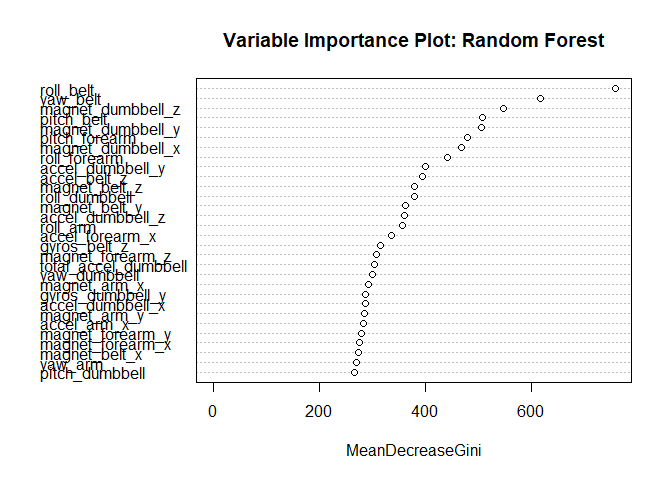

## Executive Summary
The goal of this project is to predict, using a Weight Lifting Exercises Dataset, how well (ie., in which fashion) people do an exercise activity. Using the given Training and Testing Datasets, each was subset to the relevant variables that did not contain noise or NA's.  A seed was set to ensure repeatability. A training model was developed using the Random Forest Method, with parallel processing to decrease model building duration.The resulting average accuracy was 0.995. Plotting the variable importance shows that roll_belt is the most important variable and pitch_dumbell is the least important variable. K-fold Cross Validation was used to validate the model. The expected out of sample error estimate was 0.43%.  Prediction was performed using the Random Forest model and the subset testing data. This resulted in correct predications, per the 100% quiz score.

## Introduction
The goal of this project is to predict, using a Weight Lifting Exercises Dataset, how well people do an exercise activity (See details in "Dataset" Section.) Per the paper cited in the Dataset Section below, "Six young health participants were asked to perform one set of 10 repetitions of the Unilateral Dumbbell Biceps Curl in five different fashions: exactly according to the specification (Class A), throwing the elbows to the front (Class B), lifting the dumbbell only halfway (Class C), lowering the dumbbell only halfway (Class D) and throwing the hips to the front (Class E)."  "Data were collected from accelerometers on the belt, forearm, arm, and dumbell of the 6 participants."

## Dataset
This analysis used the Weight Lifting Exercises Dataset as described here: http://groupware.les.inf.puc-rio.br/har#dataset#ixzz6BiJlujtR and in this paper:

Velloso, E.; Bulling, A.; Gellersen, H.; Ugulino, W.; Fuks, H. Qualitative Activity Recognition of Weight Lifting Exercises. Proceedings of 4th International Conference in Cooperation with SIGCHI (Augmented Human '13). Stuttgart, Germany: ACM SIGCHI, 2013.

Please note that "This dataset is licensed under the Creative Commons license (CC BY-SA). The CC BY-SA license means you can remix, tweak, and build upon this work even for commercial purposes, as long as you credit the authors of the original work and you license your new creations under the identical terms we are licensing to you. This license is often compared to "copyleft" free and open source software licenses. All new works based on this dataset will carry the same license, so any derivatives will also allow commercial use."

## How the Model was Built
The training data were already partitioned and are available at:
https://d396qusza40orc.cloudfront.net/predmachlearn/pml-training.csv

To begin to build the model, libraries were loaded to support the Machine Learning Analysis and to support parallel processing to make the analysis run faster.  A seed was set to ensure repeatability.

```r
library(caret)
library(parallel)
library(doParallel)
library(randomForest)
set.seed(123)
```

The Training data were read and explored. As both the Training and Testing Datasets were already partitioned and provided, and K-fold Cross Validation was used, the Training dataset was not further partitioned into training and testing datasets. 

```r
training = read.csv("https://d396qusza40orc.cloudfront.net/predmachlearn/pml-training.csv", as.is=TRUE)
str(training,list.len=ncol(training))
head(training)
tail(training)
```

As the Training dataset contains 160 variables, it was subset to only the 53 variables that are relevant to the activity, and also contained data. The first seven variables were not relevant to the current analysis and were therefore omitted.  Variables in the columns 12:36, 50:59, 69:83, 87:101, 103:112, 125:150 were either composed of NA's or had so little data that they were assumed to contain noise and thus were omitted. The last column  holds the "classe" variable which gives the manner in which the participants did the exercise, A, B, C, D, or E, as described in the Introduction. A check for NA's was performed to confirm that there were no NA's in the dataset. 


```r
trainingSubset <- training[,-c(1:7, 12:36, 50:59, 69:83, 87:101, 103:112, 125:150)]
str(trainingSubset)
sum(is.na(trainingSubset))
```

Parallel processing was configured.

```r
cluster <- makeCluster(detectCores() - 1) # convention to leave 1 core for OS
registerDoParallel(cluster)
```

The trainControl Object was configured, with cross validation and 5 folds.

```r
fitControl <- trainControl(method = "cv",
                           number = 5,
                           allowParallel = TRUE)
```

The training model was developed, using the Random Forest method.

```r
modRF <- train(classe ~ ., method="rf",data=trainingSubset,verbose=FALSE,trControl=fitControl)
```

The parallel processing cluster was deregistered.

```r
stopCluster(cluster)
registerDoSEQ()
```

The model was evaluated, resulting in best accuracy with mtry = 2. The resulting average accuracy was 0.995.

```r
modRF
```

```
## Random Forest 
## 
## 19622 samples
##    51 predictor
##     5 classes: 'A', 'B', 'C', 'D', 'E' 
## 
## No pre-processing
## Resampling: Cross-Validated (5 fold) 
## Summary of sample sizes: 15697, 15698, 15696, 15699, 15698 
## Resampling results across tuning parameters:
## 
##   mtry  Accuracy   Kappa    
##    2    0.9949545  0.9936174
##   26    0.9944450  0.9929732
##   51    0.9886864  0.9856884
## 
## Accuracy was used to select the optimal model using the largest value.
## The final value used for the model was mtry = 2.
```

```r
modRF$resample
```

```
##    Accuracy     Kappa Resample
## 1 0.9941401 0.9925875    Fold1
## 2 0.9931193 0.9912944    Fold2
## 3 0.9954128 0.9941975    Fold5
## 4 0.9954117 0.9941959    Fold4
## 5 0.9966887 0.9958116    Fold3
```

```r
confusionMatrix.train(modRF)
```

```
## Cross-Validated (5 fold) Confusion Matrix 
## 
## (entries are percentual average cell counts across resamples)
##  
##           Reference
## Prediction    A    B    C    D    E
##          A 28.4  0.1  0.0  0.0  0.0
##          B  0.0 19.3  0.1  0.0  0.0
##          C  0.0  0.0 17.3  0.3  0.0
##          D  0.0  0.0  0.0 16.1  0.0
##          E  0.0  0.0  0.0  0.0 18.4
##                            
##  Accuracy (average) : 0.995
```

Plotting the variable importance shows that roll_belt is the most important variable and pitch_dumbell is the least important variable.  The MeanDecreaseGini shown in the plot below is effectively a measure of how important a variable is for estimating the value of the target variable across all of the trees that make up the forest" per this discussion: https://community.alteryx.com/t5/Alteryx-Designer-Discussions/Help-Mean-Decrease-in-Gini-for-dummies/td-p/197223

```r
varImpPlot(modRF$finalModel, main= "Variable Importance Plot: Random Forest")
```

<!-- -->

## How Cross Validation was Used
K-fold Cross Validation was used in this project. K-fold Cross Validation is a method used to estimate the expected performance of a model on new data not used for model training.  

Per "An Introduction to Statistical Learning with Applications in R", page 184,https://www.amazon.com/Introduction-Statistical-Learning-Applications-Statistics/dp/1461471370/ref=as_li_ss_tl?_encoding=UTF8&pd_rd_i=1461471370&pd_rd_r=DB2D7SXCC6EFZ5MKNVK4&pd_rd_w=mz608&pd_rd_wg=PE5Zx&psc=1&refRID=DB2D7SXCC6EFZ5MKNVK4&linkCode=sl1&tag=inspiredalgor-20&linkId=1c22848a7baf8c3bed24b13800cf39e6

"There is a bias-variance trade-off associated with the choice of k in k-fold cross-validation. Typically, given these considerations, one performs k-fold cross-validation using k = 5 or k = 10, as these values have been shown empirically to yield test error rate estimates that suffer neither from excessively high bias nor from very high variance."

Thus, k = 5 was chosen for the cross validation. As shown in the results above, the estimated accuracy was 0.995, which was sufficient for answering the quiz questions correctly. (See Selection of Training Method in the Discussion of Choices Made Section)

## Expected Out of Sample Error
The Out of Bag (OOB) error rate estimate is equivalent to the out of sample error rate from other aproaches per Leonard Greski. https://www.coursera.org/learn/practical-machine-learning/discussions/weeks/4/threads/Ky6PexfEEee27wrfbfj87A

The OOB error rate is estimated as 0.43%.  


```r
print(modRF$finalModel)
```

```
## 
## Call:
##  randomForest(x = x, y = y, mtry = param$mtry, verbose = FALSE) 
##                Type of random forest: classification
##                      Number of trees: 500
## No. of variables tried at each split: 2
## 
##         OOB estimate of  error rate: 0.43%
## Confusion matrix:
##      A    B    C    D    E  class.error
## A 5577    3    0    0    0 0.0005376344
## B   12 3782    3    0    0 0.0039504872
## C    0   18 3402    2    0 0.0058445354
## D    0    0   40 3174    2 0.0130597015
## E    0    0    0    5 3602 0.0013861935
```

## Discussion of Choices Made

### No Further Partitioning of Training Data
As both the Training and Testing Datasets were already partitioned and provided, the Training dataset was not further partitioned into training and testing datasets. Further, using K-fold Cross Validation 

### Selection of Training Method
Per Course Mentor Leonard Greski's article on Required Model Accuracy for Course project, https://github.com/lgreski/datasciencectacontent/blob/master/markdown/pml-requiredModelAccuracy.md , a model accuracy of at least .99 on the training dataset is required to be able to answer the quiz questions correctly.  As Random Forest has a reputation for good accuracy it was selected as the first training methd to explore.  It did have better than .99 model accuracy, and so there was no need to try other approaches.

### Use of Parallel Processing
As initial attempts at building the model required overnight runs, the analysis approach that comes from Leonard Greski was adopted to speed up the model building:
https://github.com/lgreski/datasciencectacontent/blob/master/markdown/pml-randomForestPerformance.md
This approach resulted in about a 20 minute run on a dual core computer.

### Out of Sample Error Rate
The OOB error rate estimate is equivalent to the out of sample error rate from other aproaches per Course Mentor Leonard Greski. https://www.coursera.org/learn/practical-machine-learning/discussions/weeks/4/threads/Ky6PexfEEee27wrfbfj87A  Thus the OOB error rate estimate was used.

## Predictions
The test data were already partitioned and are available at:
https://d396qusza40orc.cloudfront.net/predmachlearn/pml-testing.csv

The Testing data were read and explored.

```r
testing = read.csv("https://d396qusza40orc.cloudfront.net/predmachlearn/pml-testing.csv", as.is=TRUE)
str(testing, list.len=ncol(testing))
head(testing)
tail(testing)
```

As with the Training data, the testing data were subset to only columns relevant for the analysis, and a check for NA's was performed.

```r
testingSubset <- testing[,-c(1:7, 12:36, 50:59, 69:83, 87:101, 103:112, 125:150)]
str(testingSubset)
sum(is.na(testingSubset))
```

Prediction was performed using the model developed above and the subset testing data. The results were successfully used to achieve a 100% score on the quiz.  However they are hidden here to comply with the Course Honor Code.

```r
predRF <- predict(modRF, newdata = testingSubset)
predRF
```

## Conclusions
A Random Forest model can be used with 0.995 accuracy to make predictions of how well people do an exercise activity (ie, in which fashion they do the exercise). The variable roll_belt is the most important variable and pitch_dumbell is the least important variable for the prediction.  The expected out of sample error rate is estimated at 0.43%.


